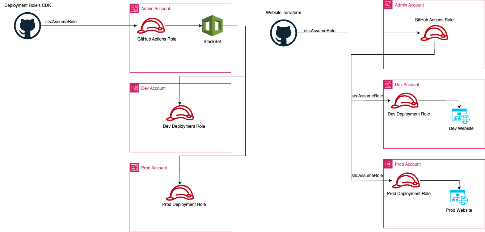

# aws_deployment_roles
This repo holds CDK code which creates a Cloudformation stackset to deploy the terraform deployment roles used for my websites deployment. View more information about my website in the [website](https://github.com/cullancarey/website) repository. 

## Architecture
The below image outlines the architecture design for this stackset and the deployment of the website utilizing the deployment roles. This model utiilizes a centralized deployment architecture. 

## CDK StackSet
This is a Python code (seen [here](./cdk/cdk/deployment_role_stack_set.py) using the AWS Cloud Development Kit (CDK) to create an AWS CloudFormation StackSet for deploying Terraform deploy roles in member accounts of an organization.

The code defines a class DeploymentRolesStackSet that extends the AWS CDK Stack class. This class has a constructor method that initializes the stack. The constructor takes in several parameters such as scope, construct_id, account_id, region, account_names, org_unit_ids, and github_oidc_role.

The cftemplate variable is an AWS S3 asset that represents the CloudFormation template that will be deployed using the StackSet. The github_oidc_role_arn variable is an Amazon Resource Name (ARN) that represents the assumed role of the GitHub OIDC role.

The cloudformation.CfnStackSet method is used to create the StackSet. The permission_model parameter is set to "SERVICE_MANAGED" which means AWS CloudFormation creates and manages the necessary AWS Identity and Access Management (IAM) resources. The stack_set_name parameter is set to "deploy-cloudformation-IAM-resources". The capabilities parameter specifies the capabilities required to create and update the StackSet.

The description parameter provides a description of the StackSet. The auto_deployment parameter specifies the configuration for automatically deploying the StackSet. The managed_execution parameter specifies that the execution is managed. The parameters parameter is used to specify the GitHub OIDC role parameter that is passed to the CloudFormation template. The stack_instances_group parameter specifies the target accounts and regions for deploying the StackSet.

Finally, the template_url parameter is used to specify the URL of the CloudFormation template that is used to create the StackSet.

## Deployment Roles Cloudformation Template
This is an AWS CloudFormation template written in YAML format seen [here](./cdk/cf_templates/terraform_deployment_roles.yaml). It creates an IAM role for deploying CDK (AWS Cloud Development Kit) resources. The template accepts one parameter GithubOIDCRole, which is the Github OIDC Role that will assume the deployment role created in this template.

The Resources section of the template defines the CDKDeployRole IAM role. It has a RoleName that is generated using the AWS::Region and AWS::AccountId CloudFormation intrinsic functions. The role is created with an AssumeRolePolicyDocument that only allows the specified GithubOIDCRole to assume the role. The role's policy TerraformRoleDeployPolicy allows all actions on all resources, as specified by the wildcard * in the Resource section. I plan to update this in future iterations to be more secure.

Overall, this CloudFormation template creates a simple IAM role with a broad set of permissions for deploying CDK resources.