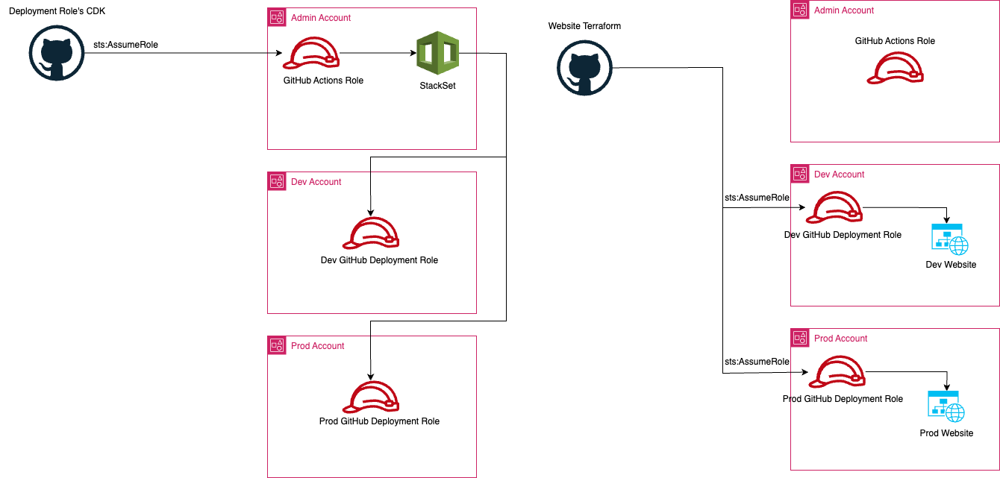

# aws_deployment_roles
This repo holds CDK code which creates a Cloudformation stackset to deploy the terraform deployment roles used for my websites deployment. View more information about my website in the [website](https://github.com/cullancarey/website) repository. 

## Architecture
The below image outlines the architecture design for this stackset and the deployment of the website utilizing the deployment roles. This model utiilizes a centralized deployment architecture. 

## CDK StackSet
This is a Python code (seen [here](./cdk/cdk/deployment_role_stack_set.py) using the AWS Cloud Development Kit (CDK) to create an AWS CloudFormation StackSet for deploying Terraform deploy roles in member accounts of an organization.

creates a StackSet that will deploy a set of IAM roles to a list of accounts. The StackSet is created using the AWS CDK, which is a set of tools that allows you to create and manage AWS resources using a familiar programming language.

The StackSet is created using the following steps:

The cftemplate asset is created, which contains the CloudFormation template that will be used to deploy the StackSet.
The github_oidc_role_arn variable is created, which contains the ARN of the GitHub OIDC role.
The CFDeployStackSet stack is created, which is the StackSet that will deploy the IAM roles.
The CFDeployStackSet stack is configured with the following properties:
- permission_model: The permission model for the StackSet.
- stack_set_name: The name of the StackSet.
- capabilities: The capabilities that the StackSet will have.
- description: The description of the StackSet.
- auto_deployment: The auto-deployment settings for the StackSet.
- managed_execution: The managed execution settings for the StackSet.
- parameters: The parameters that the StackSet will use.
- stack_instances_group: The stack instances group for the StackSet.
- template_url: The URL of the CloudFormation template that will be used to deploy the StackSet.

The CFDeployStackSet stack will deploy the IAM roles to the accounts that are specified in the account_names and org_unit_ids lists. The roles will be deployed to the specified regions.

## Deployment Roles Cloudformation Template
The CloudFormation template creates an OIDC provider and role for use with GitHub Actions. The OIDC provider is used to authenticate Github Actions automations, and the role is used to grant those users permissions to resources in AWS.

The template creates the following resources:

An OIDC provider, which is used to authenticate Github Actions automations. The provider is configured with the following settings:
- The URL of the GitHub Actions OIDC endpoint
- A list of thumbprints for GitHub Actions tokens
- A list of allowed audiences for the tokens
A service role, which is used to grant Github Actions automations permissions to resources in AWS. The role is configured with the following settings:
- The name of the role
- The path of the role
- A policy that grants Github Actions automations the following permissions:
	- sts:AssumeRoleWithWebIdentity
	- * on *
- A policy that grants the service role the following permissions:
    - * on *

The template also includes the following descriptions:

    Description: Creates and OIDC provider and role for use with GitHub Actions.
    Description: Service Role for use in GitHub Actions

The template is used to create an OIDC provider and role for use with GitHub Actions. The provider and role can then be used to authenticate GitHub Actions automations and grant them permissions to resources in AWS.
